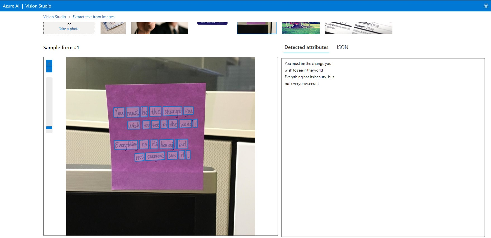

# Laboratorio 2 Dio
Trabalhando com Vision Studio

## Configurando o serviço
- Em [Portal Azure](https://portal.azure.com) procure pelo serviço "Criar Serviços Cognitivos" (Atualmente mudou a forma de criar os recursos do serviço)
- Preencha com as informações
- Após criado nós iremos acessar o portal do [Vision Cognitive Azure](https://portal.vision.cognitive.azure.com)
- No Vision Studio clique na opção "View all resources"
- Selecione o recurso que criamos e clique em "Select as default resource"

## Detectando rostos com o Vision Studio

- Na página inicial do Vision Studio selecione a aba "Face"
- Então selecione a opção "Detect faces in an image"
- Neste serviço é possível testar como ele funciona, isso pode ser visto no print abaixo

## Analise de documentos
- Na página inicial do Vision Studio selecione a aba "Optical character recognition"
- Então selecione a opção "Extract text from images"
- Neste serviço é possível testar como ele funciona, isso pode ser visto no print abaixo

## Adicionar legendas a imagnes
- Na página inicial do Vision Studio selecione a aba "Image analysis"
- Então selecione a opção "Add captions to images"
- Neste serviço é possível testar como ele funciona, isso pode ser visto no print abaixo

